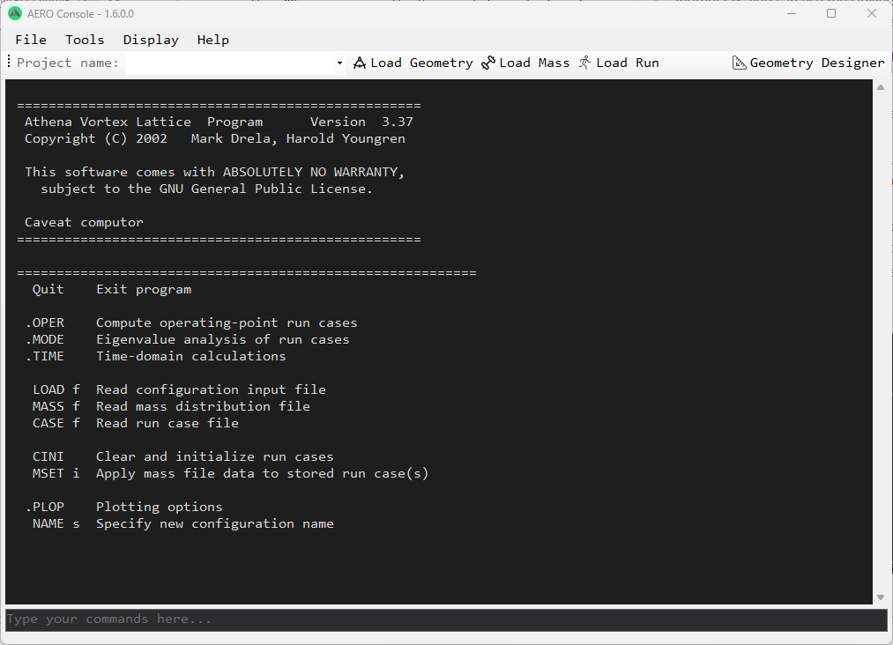
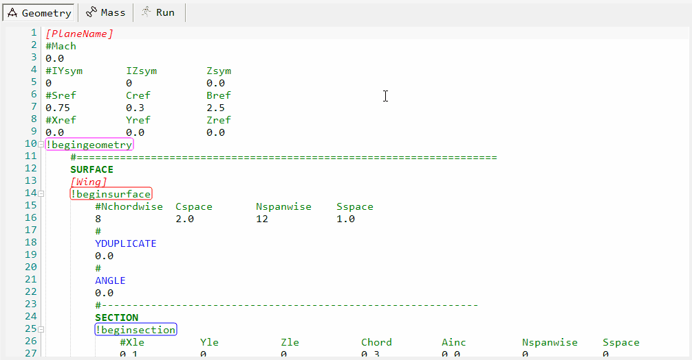
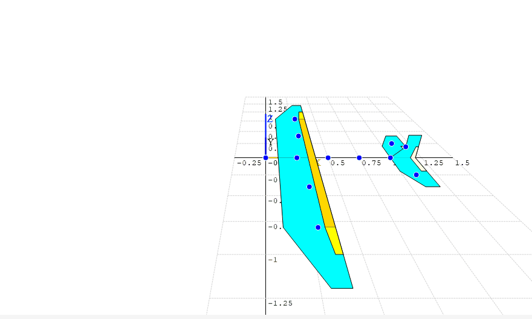
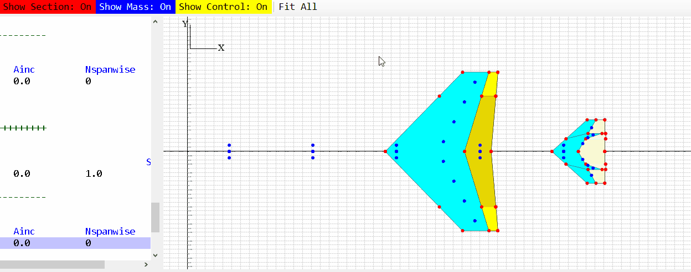
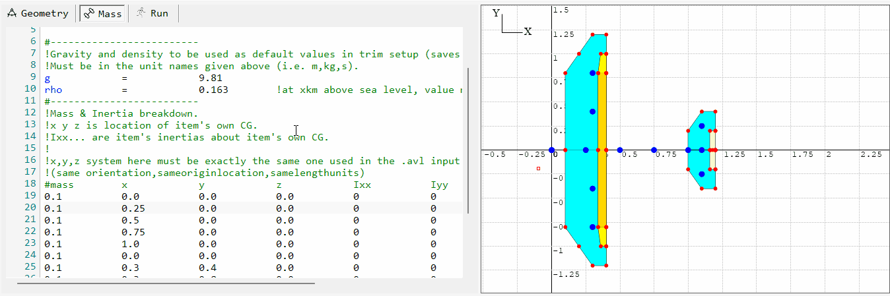

# AERO Console

[](https://github.com/drarahimi/AERO_Console/releases/latest)
[](https://github.com/drarahimi/AERO_Console/releases)
[](https://github.com/drarahimi/AERO_Console)
[](https://youtube.com/playlist?list=PLxcxum3Kgj_ZdFPVwpr5niSOyrRWJFYSp)
[](https://ko-fi.com/arahimi)

**AERO Console** is a modern graphical user interface (GUI) for Mark Drela's renowned [Athena Vortex Lattice (AVL)](https://web.mit.edu/drela/Public/web/avl/) and [XFoil](https://web.mit.edu/drela/Public/web/xfoil/) aerodynamic analysis tools.

Originally developed for the **Aerodynamics and Performance course (MECH-4671)** at the [University of Windsor](https://www.uwindsor.ca/) by [Dr. Afshin Rahimi](https://www.arahimi.ca/), this tool bridges the gap between powerful aerodynamic calculation engines and user-friendly design environments.



---

## 📖 Table of Contents
- [Background](#-background)
- [Key Features](#-key-features)
- [Installation](#-installation)
- [Important Workflow & File Structure](#-important-workflow--file-structure)
- [Tutorials & Support](#-tutorials--support)
- [Credits](#-credits)

---

## 💡 Background

AVL and XFoil are industry-standard, powerful, and free tools for aerodynamic analysis. However, their reliance on legacy DOS-command interfaces creates a steep learning curve for students and modern engineers. 

**AERO Console solves this by providing:**
* A visual design environment to replace command-line inputs.
* Real-time syntax highlighting for AVL files.
* Instant visual feedback on geometry and mass distributions.
* Streamlined workflow for design iteration.

---

## 🚀 Key Features

### 🖥️ Interface & Editor
| Feature | Preview |
| :--- | :--- |
| **Graphical User Interface**<br>User-friendly forms to manage simulation parameters. |  |
| **Syntax Highlighting**<br>Color-coded and automatically indented AVL code editor. |  |
| **Tooltip Assistance**<br>Hover over any element in Geometry, Mass, or Run files for instant definitions. |  |

### ✈️ Visualization Tools
| Feature | Preview |
| :--- | :--- |
| **3D Navigation**<br>Rotate, zoom, and pan the 3D view with mouse controls. |  |
| **Component Overlay**<br>Toggle visibility for sections, mass distribution, and control surfaces. |  |
| **Node Highlighting**<br>Interactive highlighter for geometry and mass nodes. |  |

---

## 📥 Installation

> [!NOTE]
> **Compatibility:** This software is designed exclusively for **Windows OS**. Mac/Linux users should use a Virtual Machine (VM) or Boot Camp.

1.  **Download:** Get the latest standalone version from the [Releases Page](https://github.com/drarahimi/AERO_Console/releases/latest).
2.  **Location:** Place the `.exe` file in a folder where you have **Read/Write permissions** (e.g., specific project folder, not `C:\Program Files`).
3.  **Run:** Open `AERO_Console.exe`.
    * *Security Warning:* You may see a "Windows protected your PC" popup. Click **More Info** > **Run Anyway**. This occurs because the app is not digitally signed by Microsoft.
4.  **Setup:** The program will automatically unpack necessary dependencies into the same folder.

---

## ⚠️ Important Workflow & File Structure

To ensure the software functions correctly, please adhere to the following file naming and structural rules.

### 1. Reserved Filenames
The program relies on specific temporary filenames in the root directory.

> [!WARNING]
> **Risk of Overwriting:** The program constantly writes to the files listed below. **Do not use these names for your saved projects.**
> Once you are satisfied with a design, **Rename** or **Move** these files immediately to a safe location.

| Filename | Purpose | Location |
| :--- | :--- | :--- |
| `test.avl` | Temporary Geometry File | Root Folder* |
| `test.mas` | Temporary Mass File | Root Folder* |
| `test.run` | Temporary Run File | Root Folder* |

*\*Root Folder is the directory where `AERO_Console.exe` is located.*

### 2. Geometry Hierarchy
When editing `.avl` files, you must follow this specific nesting order to prevent calculation errors or crashes:

```text
+- AVL Template (Root)
   |
   +-- Surface 1
   |    |-- Section A (Root Chord)
   |    |    +-- Control Surface
   |    |
   |    +-- Section B (Tip Chord)
   |         +-- Control Surface
   |
   +-- Surface 2 ...