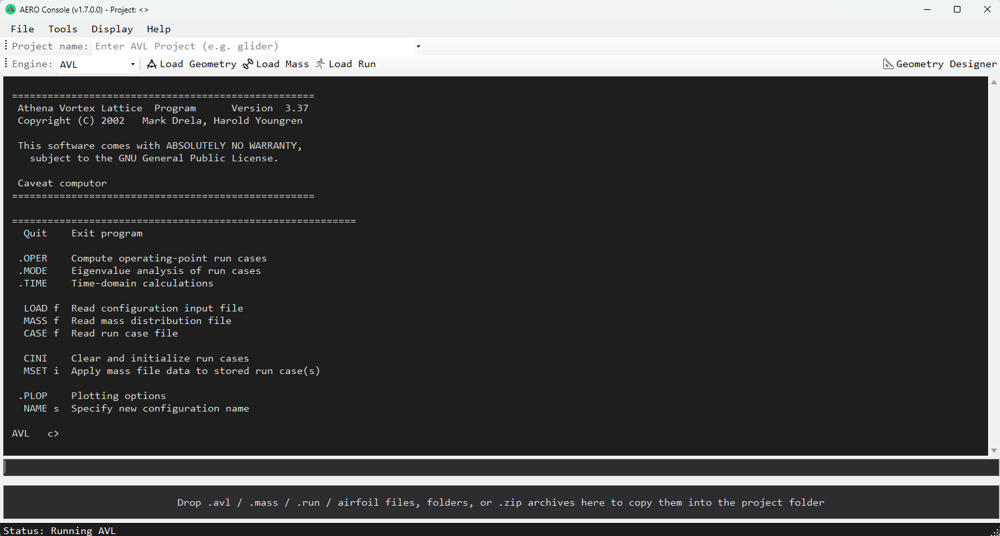
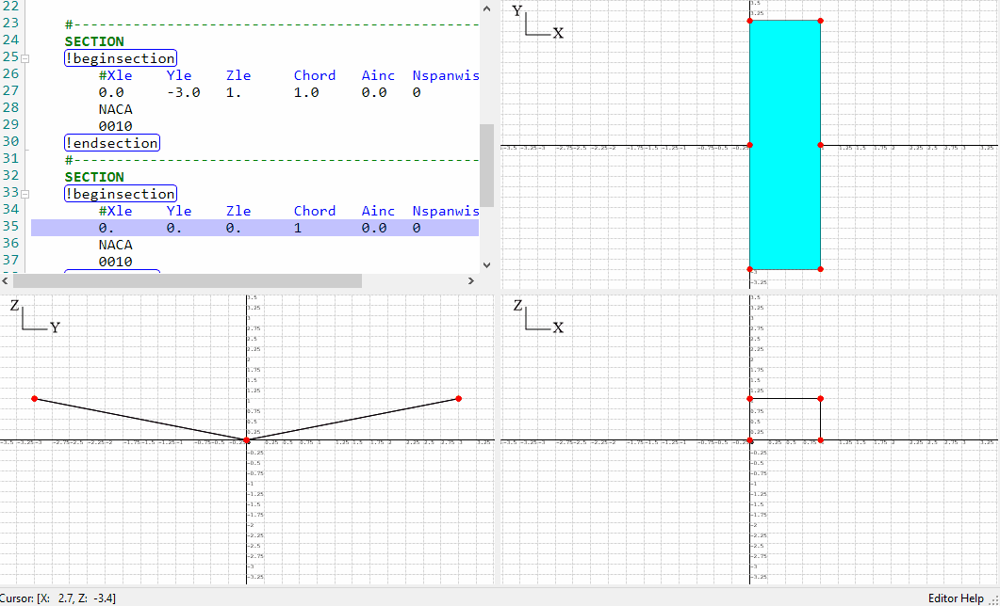
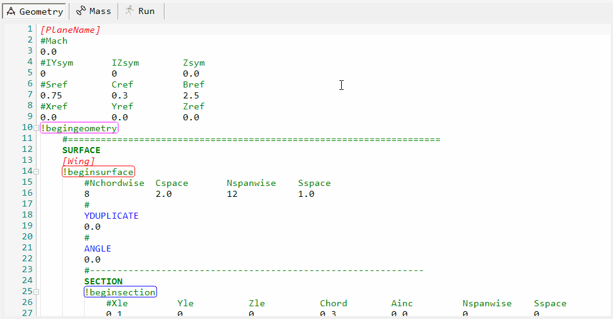
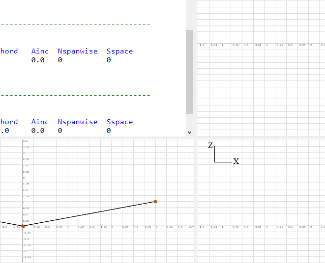
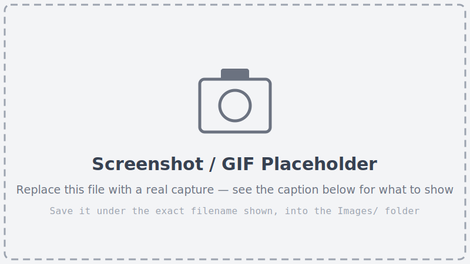
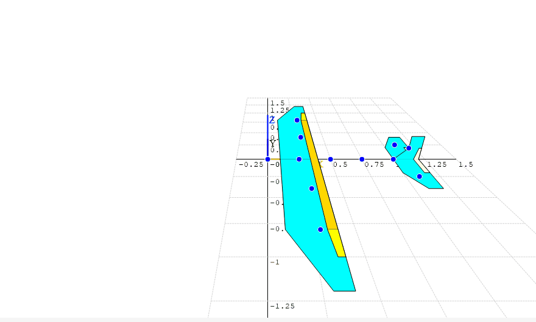
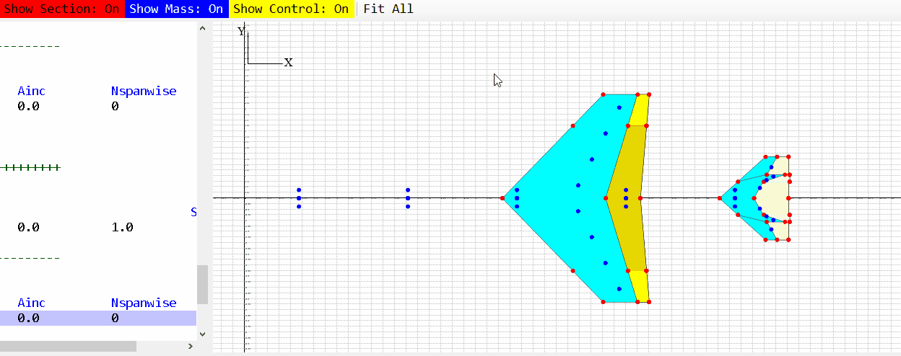
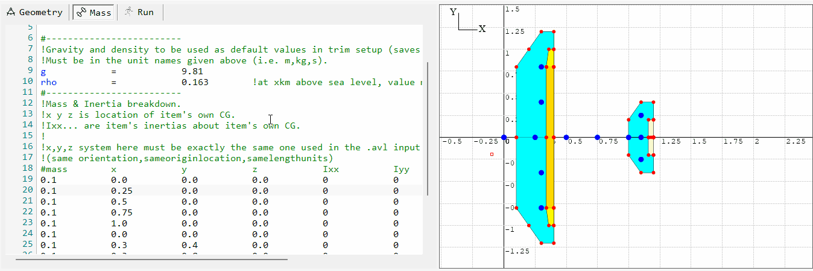

# AERO Console

[](https://github.com/drarahimi/AERO_Console/releases/latest)
[](https://github.com/drarahimi/AERO_Console/releases)
[](https://github.com/drarahimi/AERO_Console)
[](https://youtube.com/playlist?list=PLxcxum3Kgj_ZdFPVwpr5niSOyrRWJFYSp)
[](https://ko-fi.com/arahimi)

**AERO Console** is a modern graphical user interface (GUI) for Mark Drela's renowned [Athena Vortex Lattice (AVL)](https://web.mit.edu/drela/Public/web/avl/) and [XFoil](https://web.mit.edu/drela/Public/web/xfoil/) aerodynamic analysis tools.

Originally developed for the **Aerodynamics and Performance course (MECH-4671)** at the [University of Windsor](https://www.uwindsor.ca/) by [Dr. Afshin Rahimi](https://www.arahimi.ca/), this tool bridges the gap between powerful aerodynamic calculation engines and user-friendly design environments.

<p align="center">
  
</p>

---

## 📖 Table of Contents
- [Background](#-background)
- [Key Features](#-key-features)
- [Installation](#-installation)
- [Important Workflow & File Structure](#-important-workflow--file-structure)
- [Tutorials & Support](#-tutorials--support)
- [Credits](#-credits)

---

## 💡 Background

AVL and XFoil are industry-standard, powerful, and free tools for aerodynamic analysis. However, their reliance on legacy DOS-command interfaces creates a steep learning curve for students and modern engineers. 

**AERO Console solves this by providing:**
* A visual design environment to replace command-line inputs.
* Real-time syntax highlighting for AVL files.
* Instant visual feedback on geometry and mass distributions.
* Streamlined workflow for design iteration.

---

## 🚀 Key Features

### 🖥️ Interface & Editor
| Feature | Description |
| :--- | :--- |
| **Graphical User Interface** | User-friendly forms and consoles to manage simulation parameters. |
| **Syntax Highlighting** | Color-coded and automatically indented AVL/XFOIL code editor. |
| **Custom Owner-Drawn ToolTips** | Hover over key terms for monospace (`Consolas` 10-11pt) helper explanations in clean white card styling, with the exact term you're hovering over bolded and color-highlighted everywhere it appears in the excerpt. |
| **Project-Gated Workspace** | The editor stays locked — no tabs, toolbars, or panels — until you create a new project or load an existing one from the dropdown (or via **File → Load Test Project**), so nothing can act on files that aren't associated with any project. |
| **File Menu** | **Load Test Project**: three ready-to-run projects, all verified against the real AVL engine — **Simple** (a single flat wing, no controls), **Standard** (a 3-surface aircraft exercising every analysis tab), and **Advanced** (5 surfaces exercising SCALE, TRANSLATE, ANGLE, COMPONENT grouping, and NOWAKE). **Make a Copy of This Project...**: saves your current edits, then copies the active project's `.avl`/`.mass`/`.run` files under a name suffix you choose and switches to editing the copy — a quick way to branch off a design before trying something risky, without losing the original. |
| **Autosave Control** | Toggle auto-saving on/off. When off, a warning indicates dirty states, and prompts confirm closing, tab changes, or project reloads. |
| **Optimized Rendering** | Batched console log updates and cached font/GDI+ resources eliminate textbox/combobox flicker and reduce CPU/fan load during heavy AVL output. |
| **Drag-and-Drop File Import** | Drop `.avl`/`.mass`/`.run`/airfoil files, whole folders, or `.zip` archives onto the drop zone at the bottom of the main window. Archives are extracted and folder structures are flattened automatically, with collision-safe renaming and a runtime-file exclusion list so the app's own `.exe`/`.dll` files can never be overwritten by accident. |
| **Light / Dark Theme** | Toolbar toggle switches every custom-drawn view — 2D/3D geometry, all analysis plots, and the Derivatives tab — between light and dark palettes. The choice is saved to user settings and restored automatically on the next launch. |
| **Release Packaging** *(maintainers)* | **File → Package as Zip (Portable)** zips the bare-minimum runtime files to the Desktop. **File → Package as Standalone Exe** publishes a single self-sufficient `.exe` (bundles its dependencies, no sibling DLLs needed) to the Desktop — both are ready to attach straight to a GitHub Release. |

#### 📺 Interface Visual Showcase
<table width="100%">
  <tr>
    <td align="center">
      <b>Interactive Graphical Interface</b><br/><br/>
      
    </td>
  </tr>
  <tr>
    <td align="center">
      <b>Syntax Highlighting Editor</b><br/><br/>
      
    </td>
  </tr>
  <tr>
    <td align="center">
      <b>Custom Owner-Drawn ToolTips</b><br/><br/>
      
    </td>
  </tr>
  <tr>
    <td align="center">
      <b>Project-Gated Workspace</b><br/><br/>
      <br/>
      <sub>🎬 <b>To capture:</b> Open a fresh Geometry Designer window (no project loaded) and screenshot the "No project selected" overlay covering the whole window, with the toolbar's project name box visible above it. Save as <code>Images/project-gate.png</code>.</sub>
    </td>
  </tr>
  <tr>
    <td align="center">
      <b>File Menu</b><br/><br/>
      <br/>
      <sub>🎬 <b>To capture:</b> A GIF opening the toolbar's File menu, hovering into the Load Test Project submenu (showing Simple/Standard/Advanced), then clicking Make a Copy of This Project and showing the suffix prompt. Save as <code>Images/file-menu.gif</code>.</sub>
    </td>
  </tr>
  <tr>
    <td align="center">
      <b>Autosave Control</b><br/><br/>
      <br/>
      <sub>🎬 <b>To capture:</b> A GIF toggling the Autosave button off, editing the file to show the red "Unsaved Changes" warning and Save button appear, then clicking Save and toggling Autosave back on. Save as <code>Images/autosave-toggle.gif</code>.</sub>
    </td>
  </tr>
  <tr>
    <td align="center">
      <b>Optimized Rendering</b><br/><br/>
      <br/>
      <sub>🎬 <b>To capture:</b> Optional/hard to show directly - a GIF of fast typing/scrolling in the editor while AVL streams console output, demonstrating no flicker or lag. Save as <code>Images/optimized-rendering.gif</code>.</sub>
    </td>
  </tr>
  <tr>
    <td align="center">
      <b>Drag-and-Drop File Import</b><br/><br/>
      <br/>
      <sub>🎬 <b>To capture:</b> A GIF dragging a folder (or .zip) containing .avl/.mass/.run files onto the drop zone at the bottom of the main window, showing the files land in the project list. Save as <code>Images/drag-drop-import.gif</code>.</sub>
    </td>
  </tr>
  <tr>
    <td align="center">
      <b>Light / Dark Theme</b><br/><br/>
      <br/>
      <sub>🎬 <b>To capture:</b> A GIF clicking the theme toggle button, showing the 2D/3D geometry views and an analysis plot switch between light and dark palettes. Save as <code>Images/theme-toggle.gif</code>.</sub>
    </td>
  </tr>
  <tr>
    <td align="center">
      <b>Release Packaging</b><br/><br/>
      <br/>
      <sub>🎬 <b>To capture:</b> (Maintainers) A GIF of File → Package as Zip (Portable) and File → Package as Standalone Exe, showing the resulting file appear on the Desktop. Save as <code>Images/release-packaging.gif</code>.</sub>
    </td>
  </tr>
</table>

### ✈️ Visualization Tools
| Feature | Description |
| :--- | :--- |
| **3D Navigation** | Rotate, zoom, and pan the 3D view with mouse controls. Dragging orbits around the model's own center rather than the world origin, the scroll-wheel zoom range scales to the model's size, and all geometry, control-surface fills, and mass points are depth-sorted (painter's algorithm) for correct front-to-back layering at any angle. |
| **View Presets** | One-click camera presets (Isometric, Default, Front, Back, Left, Right, Top, Bottom) from the 3D view's **View ▾** button, plus a live readout in the top-left corner showing the current α/β/γ rotation, color-matched to the X/Y/Z axis gizmo. |
| **Rotation Hint** | A "?" button on the 3D view (hover or click) explains exactly which mouse-drag direction rotates the model around which axis, matched to the color-coded axis gizmo on screen. |
| **Component Overlay** | Toggle visibility for sections, mass distribution, control surfaces, and vortex-lattice panels mesh. |
| **3D Mesh Rendering** | Displays panels mesh overlay in 3D visualization with proper perspective coordinates clipping. |
| **Node Highlighting** | Interactive highlighter for geometry and mass nodes. |
| **ClearType Typography** | High-fidelity text rendering using `ClearTypeGridFit` for smooth grids, labels, and documentation; axis tick labels use a regular-weight `Consolas` font for crisp, non-bold numerals. |
| **Centered Fit All** | Automated scaling with dynamic margins padding to keep models centered with breathing room. |

#### 📺 Visualization Visual Showcase
<table width="100%">
  <tr>
    <td align="center">
      <b>3D Interactive Navigation</b><br/><br/>
      
    </td>
  </tr>
  <tr>
    <td align="center">
      <b>View Presets</b><br/><br/>
      <br/>
      <sub>🎬 <b>To capture:</b> A GIF opening the 3D view's View ▾ button and clicking through Isometric, Front, Back, and Top, showing the camera snap to each and the α/β/γ readout in the top-left corner update each time. Save as <code>Images/view-presets.gif</code>.</sub>
    </td>
  </tr>
  <tr>
    <td align="center">
      <b>Component Overlay Controls</b><br/><br/>
      
    </td>
  </tr>
  <tr>
    <td align="center">
      <b>3D Mesh Rendering</b><br/><br/>
      <br/>
      <sub>🎬 <b>To capture:</b> A screenshot of the 3D view with the vortex-lattice mesh overlay toggled on, showing the chordwise/spanwise panel grid on a wing surface. Save as <code>Images/mesh-overlay.png</code>.</sub>
    </td>
  </tr>
  <tr>
    <td align="center">
      <b>Geometry &amp; Mass Node Highlighting</b><br/><br/>
      
    </td>
  </tr>
  <tr>
    <td align="center">
      <b>Rotation Hint</b><br/><br/>
      <br/>
      <sub>🎬 <b>To capture:</b> A screenshot of the 3D view's "?" button with its tooltip open, showing the axis-rotation explanation text and the color-coded axis gizmo it refers to. Save as <code>Images/rotation-hint.png</code>.</sub>
    </td>
  </tr>
  <tr>
    <td align="center">
      <b>ClearType Typography</b><br/><br/>
      <br/>
      <sub>🎬 <b>To capture:</b> Optional/subtle - a zoomed-in screenshot of axis tick labels on a plot, showing crisp, non-bold, ClearType-rendered numerals. Save as <code>Images/cleartype-typography.png</code>.</sub>
    </td>
  </tr>
  <tr>
    <td align="center">
      <b>Centered Fit All</b><br/><br/>
      <br/>
      <sub>🎬 <b>To capture:</b> A GIF of a 2D or 3D view zoomed/panned off-center, then clicking Fit All and showing it snap back to a centered, properly padded view. Save as <code>Images/fit-all.gif</code>.</sub>
    </td>
  </tr>
</table>

### ⚙️ Multi-Engine Support (AVL & XFOIL)
- **Engine Switching**: Switch seamlessly between AVL and XFOIL engines from the main ToolStrip.
- **Auto-Downloader**: Automatically downloads and unzips `XFOIL6.99.zip` from MIT's official server into the local `appdata/` directory when first activated.
- **Contextual Actions**: Button labels, tooltips, and background execution pathways dynamically morph to support the active tool:
  - **AVL Mode**: Load Geometry (`.avl`), Load Mass (`.mass`), Load Run (`.run`).
  - **XFOIL Mode**: Load Airfoil (`.dat` or NACA codes), Init Polar (`pacc`), Run Alpha (`alfa` interactive prompt).
- **Plot Controller**: A specialized "Close Plot" action dispatches safety escape key sequences and restarts XFOIL automatically if it terminates, ensuring plotting windows close cleanly.

#### 📺 Multi-Engine Visual Showcase
<table width="100%">
  <tr>
    <td align="center">
      <b>Engine Switching</b><br/><br/>
      <br/>
      <sub>🎬 <b>To capture:</b> A GIF switching the Engine dropdown between AVL and XFOIL, showing the button labels (Load Geometry/Mass/Run vs. Load Airfoil/Init Polar/Run Alpha) change. Save as <code>Images/engine-switching.gif</code>.</sub>
    </td>
  </tr>
  <tr>
    <td align="center">
      <b>Auto-Downloader</b><br/><br/>
      <br/>
      <sub>🎬 <b>To capture:</b> A GIF of first-time XFOIL activation, showing the automatic download/unzip of XFOIL6.99.zip into the appdata/ folder. Save as <code>Images/xfoil-auto-download.gif</code>.</sub>
    </td>
  </tr>
  <tr>
    <td align="center">
      <b>Contextual Actions</b><br/><br/>
      <br/>
      <sub>🎬 <b>To capture:</b> A side-by-side (or before/after) screenshot comparing the main toolbar in AVL mode vs. XFOIL mode, showing the button labels and tooltips change. Save as <code>Images/contextual-actions.png</code>.</sub>
    </td>
  </tr>
  <tr>
    <td align="center">
      <b>Plot Controller</b><br/><br/>
      <br/>
      <sub>🎬 <b>To capture:</b> A GIF clicking Close Plot on an open XFOIL plotting window, showing it close cleanly (including a case where XFOIL needed to restart). Save as <code>Images/close-plot.gif</code>.</sub>
    </td>
  </tr>
</table>

### 📊 Analysis & Plots
All of the plots below are rendered natively by AERO Console rather than opening AVL's own graphics window, so every one supports the same PNG/SVG/PDF export as the geometry views and runs from an in-tab **Run** button — no separate menu needed.

| Feature | Description |
| :--- | :--- |
| **Trefftz Plane Plot** | In-house recreation of AVL's Trefftz Plane window: spanwise circulation/downwash distribution plus the full coefficient readout (CL, CD, e, etc.), pulled directly from AVL rather than screen-scraped. |
| **Loads (Shear & Bending Moment)** | Spanwise shear force and bending moment distribution per surface, from AVL's `VM` command. |
| **Drag Polar** | Runs a configurable alpha sweep and plots the resulting CL–CD polar. |
| **Derivatives** | Stability and control derivatives (`ST`, `SB`, `FN`, `FB`, `HM`), shown as AVL's own formatted text output. |
| **Pressure / Element Forces** | Chordwise pressure distribution per strip, from AVL's `FE` command, with a strip selector. |
| **Dynamics (Eigenmodes)** | Root-locus/eigenvalue plot from AVL's `.MODE` analysis, with automatic mode classification (Phugoid, Short Period, Dutch Roll, Roll Subsidence, Spiral), hover tooltips showing ωₙ/ζ/period/stability, mouse-wheel zoom and click-drag panning to inspect closely-spaced roots, and a **Stability Tips** button explaining how to fix an unstable mode via geometry or mass changes and why it helps. |

#### 📺 Analysis & Plots Visual Showcase
<table width="100%">
  <tr>
    <td align="center">
      <b>Trefftz Plane Plot</b><br/><br/>
      <br/>
      <sub>🎬 <b>To capture:</b> A screenshot of the Trefftz tab after clicking Run, showing the spanwise circulation/downwash curve and the CL/CD/e coefficient readout. Save as <code>Images/trefftz-plot.png</code>.</sub>
    </td>
  </tr>
  <tr>
    <td align="center">
      <b>Loads (Shear &amp; Bending Moment)</b><br/><br/>
      <br/>
      <sub>🎬 <b>To capture:</b> A screenshot of the Loads tab showing the spanwise shear force and bending moment curves for a multi-surface aircraft. Save as <code>Images/loads-plot.png</code>.</sub>
    </td>
  </tr>
  <tr>
    <td align="center">
      <b>Drag Polar</b><br/><br/>
      <br/>
      <sub>🎬 <b>To capture:</b> A screenshot of the Polar tab after running an alpha sweep, showing the resulting CL–CD curve. Save as <code>Images/drag-polar.png</code>.</sub>
    </td>
  </tr>
  <tr>
    <td align="center">
      <b>Derivatives</b><br/><br/>
      <br/>
      <sub>🎬 <b>To capture:</b> A screenshot of the Derivatives tab showing the formatted ST/SB/FN/FB/HM text output and the static-stability insight panel. Save as <code>Images/derivatives-tab.png</code>.</sub>
    </td>
  </tr>
  <tr>
    <td align="center">
      <b>Pressure / Element Forces</b><br/><br/>
      <br/>
      <sub>🎬 <b>To capture:</b> A screenshot of the Pressure tab showing the chordwise pressure distribution for a selected strip. Save as <code>Images/pressure-plot.png</code>.</sub>
    </td>
  </tr>
  <tr>
    <td align="center">
      <b>Dynamics (Eigenmodes)</b><br/><br/>
      <br/>
      <sub>🎬 <b>To capture:</b> A GIF of the Dynamics tab's root-locus plot, showing mode labels (Phugoid/Dutch Roll/etc.), a hover tooltip, and zooming/panning into a cluster of closely-spaced roots. Save as <code>Images/dynamics-plot.gif</code>.</sub>
    </td>
  </tr>
</table>

### 🖱️ Interactive Geometry Editing
| Feature | Description |
| :--- | :--- |
| **Properties Panel** | Click any Section, Control, or Mass node in the 2D/3D views to open a side panel of editable fields (Xle/Yle/Zle/Chord/Ainc/Airfoil for sections; Cname/Cgain/Xhinge/XYZhvec/SgnDup for controls; Mass/X/Y/Z/Ixx/Iyy/Izz for mass points). Edits write straight back to the underlying line - the raw text editor remains the source of truth - and it correctly handles mirrored (`YDUPLICATE`) geometry. |
| **Field Help Tooltips** | Every properties-panel field has a "?" hint describing what it does, sourced from AVL's own documentation. |
| **Structure Tree** | A collapsible Surface → Section → Control navigator with drag-and-drop reordering/reassignment (type-aware: Sections only accept drops onto Sections/Surfaces, Controls only onto Controls/Sections), Add/Delete buttons, single-click-to-navigate, and double-click-to-open-properties. |
| **Drag-to-Reposition** | Toggle Drag Mode to directly drag leading/trailing edges and control hinges in any 2D view; the underlying line updates automatically. |
| **Auto-Prettify** | Edits made through the Properties Panel or Structure Tree automatically re-align the file's column formatting, so panel edits and manual edits never leave the file with mismatched spacing. |

#### 📺 Interactive Geometry Editing Visual Showcase
<table width="100%">
  <tr>
    <td align="center">
      <b>Properties Panel</b><br/><br/>
      <br/>
      <sub>🎬 <b>To capture:</b> A GIF clicking a Section node in the 2D/3D view to open the Properties Panel, editing a field (e.g. Chord), and showing the geometry update live. Save as <code>Images/properties-panel.gif</code>.</sub>
    </td>
  </tr>
  <tr>
    <td align="center">
      <b>Field Help Tooltips</b><br/><br/>
      <br/>
      <sub>🎬 <b>To capture:</b> A screenshot of the Properties Panel with a "?" hint hovered/open next to a field, showing its explanation text. Save as <code>Images/field-help-tooltip.png</code>.</sub>
    </td>
  </tr>
  <tr>
    <td align="center">
      <b>Structure Tree</b><br/><br/>
      <br/>
      <sub>🎬 <b>To capture:</b> A GIF of the Structure Tree panel, dragging a Section to reorder it within a Surface, and double-clicking a node to open its Properties Panel. Save as <code>Images/structure-tree.gif</code>.</sub>
    </td>
  </tr>
  <tr>
    <td align="center">
      <b>Drag-to-Reposition</b><br/><br/>
      <br/>
      <sub>🎬 <b>To capture:</b> A GIF toggling Drag Mode on, then dragging a leading/trailing edge or control hinge directly in a 2D view, showing the underlying text update automatically. Save as <code>Images/drag-reposition.gif</code>.</sub>
    </td>
  </tr>
  <tr>
    <td align="center">
      <b>Auto-Prettify</b><br/><br/>
      <br/>
      <sub>🎬 <b>To capture:</b> A before/after GIF or screenshot pair showing a file's misaligned columns snap into clean, aligned formatting after an edit via the Properties Panel. Save as <code>Images/auto-prettify.gif</code>.</sub>
    </td>
  </tr>
</table>

---

## 📥 Installation

> [!NOTE]
> **Compatibility:** This software is designed exclusively for **Windows OS**. Mac/Linux users should use a Virtual Machine (VM) or Boot Camp.

1.  **Download:** Get the latest standalone version from the [Releases Page](https://github.com/drarahimi/AERO_Console/releases/latest).
2.  **Location:** Place the `.exe` file in a folder where you have **Read/Write permissions** (e.g., specific project folder, not `C:\Program Files`).
3.  **Run:** Open `AERO_Console.exe`.
    * *Security Warning:* You may see a "Windows protected your PC" popup. Click **More Info** > **Run Anyway**. This occurs because the app is not digitally signed by Microsoft.
4.  **Setup:** The program will automatically unpack necessary dependencies into the same folder.

---

## ⚠️ Important Workflow & File Structure

To ensure the software functions correctly, please adhere to the following file naming and structural rules.

### 1. Reserved Filenames
The program relies on specific temporary filenames in the root directory.

> [!WARNING]
> **Risk of Overwriting:** The program constantly writes to the files listed below. **Do not use these names for your saved projects.**
> Once you are satisfied with a design, **Rename** or **Move** these files immediately to a safe location.

| Filename | Purpose | Location |
| :--- | :--- | :--- |
| `test.avl` | Temporary Geometry File | Root Folder* |
| `test.mas` | Temporary Mass File | Root Folder* |
| `test.run` | Temporary Run File | Root Folder* |

*\*Root Folder is the directory where `AERO_Console.exe` is located.*

### 2. Geometry Hierarchy
When editing `.avl` files, you must follow this specific nesting order to prevent calculation errors or crashes:

```text
+- AVL Template (Root)
   |
   +-- Surface 1
   |    |-- Section A (Root Chord)
   |    |    +-- Control Surface
   |    |
   |    +-- Section B (Tip Chord)
   |         +-- Control Surface
   |
   +-- Surface 2 ...
```

The **Structure Tree** panel (see [Interactive Geometry Editing](#-interactive-geometry-editing) above) enforces this same nesting automatically when adding, deleting, or dragging blocks to reorder them.